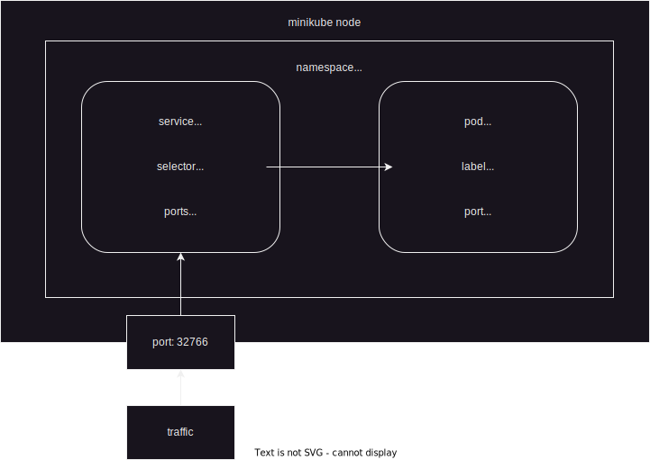

University: [ITMO University](https://itmo.ru/ru/)  
Faculty: [FICT](https://fict.itmo.ru)  
Course: [Introduction to distributed technologies](https://github.com/itmo-ict-faculty/introduction-to-distributed-technologies)  
Year: 2023/2024  
Group: K4110c  
Author: Trapezin Andrey  
Lab: Lab1  
Date of create: 28.09.2023  
Date of finished: 31.09.2023
---
### Выполнение лабораторной работы

Проверена текущая версию докера
```bash
docker version
Client:
 Cloud integration: v1.0.29
 Version:           20.10.21
 API version:       1.41
 Go version:        go1.18.7
 Git commit:        baeda1f
 Built:             Tue Oct 25 18:01:18 2022
 OS/Arch:           darwin/amd64
 Context:           default
 Experimental:      true

Server: Docker Desktop 4.15.0 (93002)
 Engine:
  Version:          20.10.21
  API version:      1.41 (minimum version 1.12)
  Go version:       go1.18.7
  Git commit:       3056208
  Built:            Tue Oct 25 18:00:19 2022
  OS/Arch:          linux/amd64
  Experimental:     false
 containerd:
  Version:          1.6.10
  GitCommit:        770bd0108c32f3fb5c73ae1264f7e503fe7b2661
 runc:
  Version:          1.1.4
  GitCommit:        v1.1.4-0-g5fd4c4d
 docker-init:
  Version:          0.19.0
  GitCommit:        de40ad0
```

Развернут кластер minikube. Проверена работоспособность.
```bash
➜  2023_2024-introduction_to_distributed_technologies-k4110c-trapezin_a_a git:(main) ✗ minikube start
😄  minikube v1.31.2 on Darwin 13.5.1
✨  Automatically selected the docker driver. Other choices: hyperkit, virtualbox, ssh
📌  Using Docker Desktop driver with root privileges
👍  Starting control plane node minikube in cluster minikube
🚜  Pulling base image ...
💾  Downloading Kubernetes v1.27.4 preload ...
    > preloaded-images-k8s-v18-v1...:  393.21 MiB / 393.21 MiB  100.00% 8.28 Mi
    > gcr.io/k8s-minikube/kicbase...:  447.62 MiB / 447.62 MiB  100.00% 6.06 Mi
🔥  Creating docker container (CPUs=2, Memory=4000MB) ...
🐳  Preparing Kubernetes v1.27.4 on Docker 24.0.4 ...
    ▪ Generating certificates and keys ...
    ▪ Booting up control plane ...
    ▪ Configuring RBAC rules ...
🔗  Configuring bridge CNI (Container Networking Interface) ...
🔎  Verifying Kubernetes components...
    ▪ Using image gcr.io/k8s-minikube/storage-provisioner:v5
🌟  Enabled addons: storage-provisioner, default-storageclass

❗  /usr/local/bin/kubectl is version 1.25.2, which may have incompatibilities with Kubernetes 1.27.4.
    ▪ Want kubectl v1.27.4? Try 'minikube kubectl -- get pods -A'
🏄  Done! kubectl is now configured to use "minikube" cluster and "default" namespace by default
➜  2023_2024-introduction_to_distributed_technologies-k4110c-trapezin_a_a git:(main) ✗ kubectx minikube
Switched to context "minikube".
➜  2023_2024-introduction_to_distributed_technologies-k4110c-trapezin_a_a git:(main) ✗ k get all
NAME                 TYPE        CLUSTER-IP   EXTERNAL-IP   PORT(S)   AGE
service/kubernetes   ClusterIP   10.96.0.1    <none>        443/TCP   80s
```

Создано пространство имен для выполнения лабораторных имен.
```bash
➜  lab1 git:(main) ✗ k create ns labs
namespace/labs created
```

Создан стандартный шаблон helm.
```bash
➜  lab1 git:(main) ✗ helm create vault
```

Отредактирован values.yaml файл, через который происходит подстановка основных значений в шаблоны helm. Задан образ контейнера, тип сервиса и порт, на котором запускается приложение.
```yaml
image:
  repository: vault
  tag: "1.13.3"
service:
  type: NodePort
  port: 8200
```

Установлены приложения k8s в окружение labs с помощью ранее заготовленных шаблонов.
```bash
➜  lab1 git:(main) ✗ helm install vault -n labs vault
```

Проверено наличие пода.
```bash
➜  lab1 git:(main) ✗ k -n labs get po
NAME                     READY   STATUS    RESTARTS   AGE
vault-7f9b5f988c-2s5tk   1/1     Running   0          2m45s
```

Просмотрены логи контейнера для нахождения рут токена от приложения vault.
```bash
➜  lab1 git:(main) ✗ k -n labs logs vault-7f9b5f988c-2s5tk
...
Root Token: hvs.KiqedfhKVVl56xlA8F6wmtc2
...
```

Прокинут локальный порт 8200 в контейнер.
```bash
➜  lab1 git:(main) ✗ k -n labs port-forward service/vault 8200:8200
Forwarding from 127.0.0.1:8200 -> 8200
Forwarding from [::1]:8200 -> 8200
```

Теперь vault дотсупен по ссылке http://localhost:8000


Для аторизации в vault в поле токена введен root token из логов.


### Схема организации контейнеров и сервисов 
