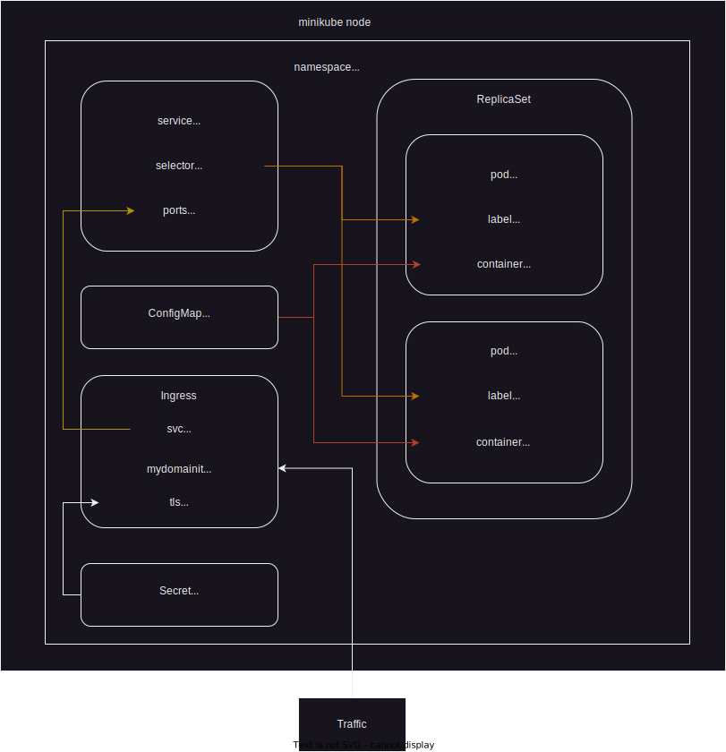

University: [ITMO University](https://itmo.ru/ru/)  
Faculty: [FICT](https://fict.itmo.ru)  
Course: [Introduction to distributed technologies](https://github.com/itmo-ict-faculty/introduction-to-distributed-technologies)  
Year: 2023/2024  
Group: K4110c  
Author: Trapezin Andrey  
Lab: Lab3  
Date of create: 29.09.2023  
Date of finished: 31.09.2023
---
### Выполнение лабораторной работы

Сгенерирован tls сертификат mydomainitmo.crt и ключ к нему.
```bash
openssl req -new -newkey rsa:2048 -nodes \
  -subj "/C=GB/ST=England/L=Brighton/O=Example/CN=*.mydomainitmo.com/emailAddress=info@example.com" \
  -reqexts SAN \
  -config <(cat /etc/ssl/openssl.cnf \
        <(printf "\n[SAN]\nsubjectAltName=DNS:mydomainitmo.com,DNS:www.mydomainitmo.com")) \
  -keyout mydomainitmo.key \
  -x509 -days 3650 -extensions SAN -out mydomainitmo.crt
```

Проверен сгенерированный сертификат.
```bash
openssl x509 -in /tmp/example.com.crt -noout -text
```

Создан секрет типа kubernetes.io/tls для использования сгенерированного сертификата в ингрессе.
```bash
➜  lab3 git:(main) ✗ k create secret tls react-app-tls --cert=server.crt --key=private.key -n labs
secret/react-app-tls created
```

Отредактирован values.yaml для генерации ингресса. 
values.yaml
```yaml
ingress:
  enabled: true
  className: "nginx"
  hosts:
    - host: mydomainitmo.com
      paths:
        - path: /
          pathType: ImplementationSpecific
          backend:
            service:
              name: react-app
              port:
                number: 3000
  tls:
    - secretName:  react-app-tls
      hosts:
        - mydomainitmo.com
```

Обновлен helm release для генерации компонентов k8s в окружении labs.
```bash
➜  lab3 git:(main) ✗ helm update react-app -n labs react-app
```

Выполнена команда для доступа к ingress.
```bash
➜  ~ minikube tunnel
✅  Tunnel successfully started

📌  NOTE: Please do not close this terminal as this process must stay alive for the tunnel to be accessible ...

❗  The service/ingress react-app requires privileged ports to be exposed: [80 443]
🔑  sudo permission will be asked for it.
🏃  Starting tunnel for service react-app.
```

Прописаны ip адрес и FQDN в /etc/hosts.

/etc/hosts
```bash
127.0.0.1    mydomainitmo.com
```

Проверена работоспособность ингресса mydomainitmo.com.


Проверена информация об используемом сертификате.


### Схема организации контейнеров и сервисов 
